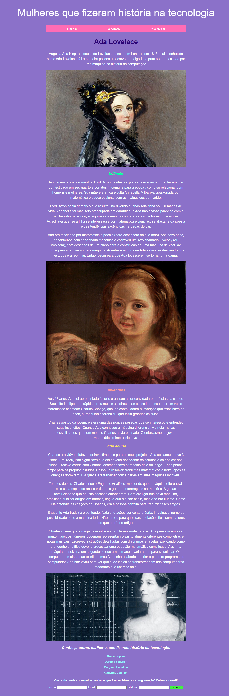

# siteada
Desenvolvimento de um site simples realizado no Curso Online Eu Programo da PrograMaria. 

Foi usado: 
#### Conceitos Básicos de JavaScript
- Sintaxe do JavaScript.
- Inputs e Formulários.
- Lógica de Interação.
- Condições.
- Funções no JavaScript.

#### Conceitos Básicos de CSS
- Sintaxe do CSS.
- Ajustando e estilizando fontes e textos.
- Ajustando planos de fundo.
- Classes e IDs.
- Margens e Padding.
- Menus, âncoras e hierarquia de seletores.

#### Conceito básicos de HTML
- Tags e a Linguagem de Marcação.
- Hierarquia, identação e estrutura.
- Imagens e Acessibilidade.
- Listas.
- Adicionando Links.
##

  <a href="https://github.com/adriellemarques">
  

